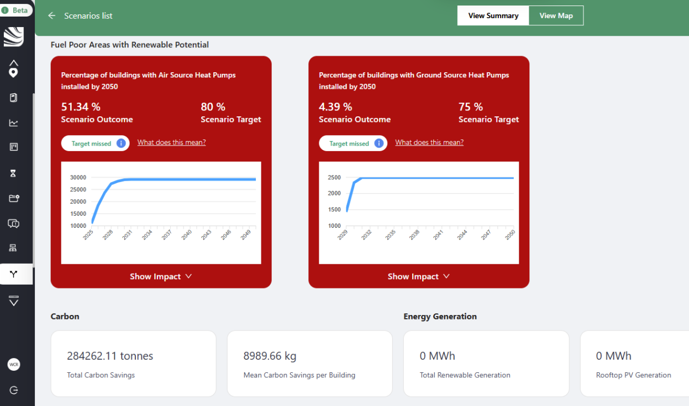
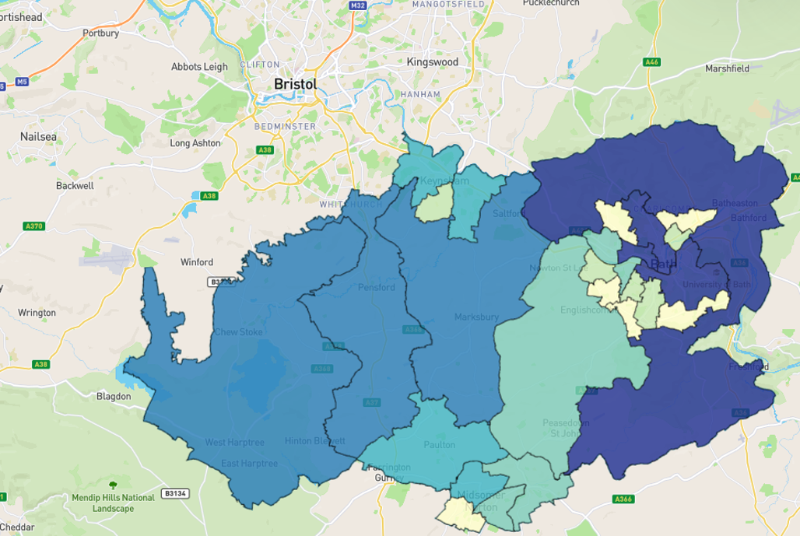
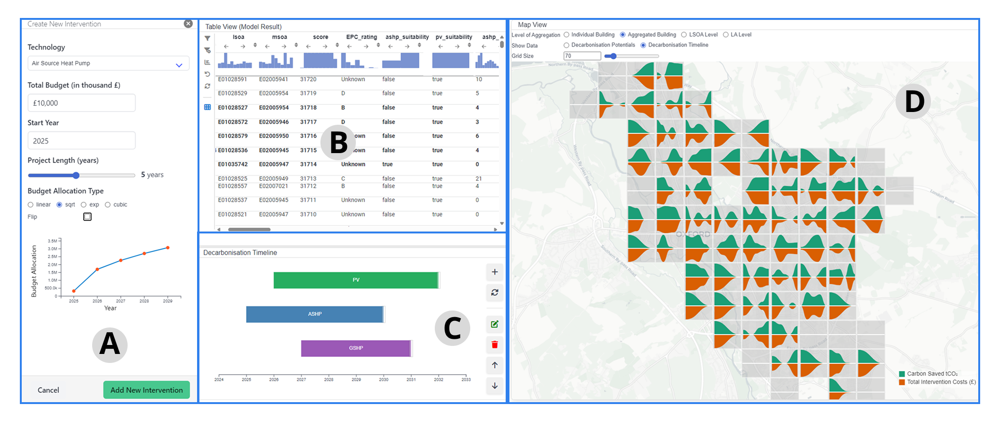
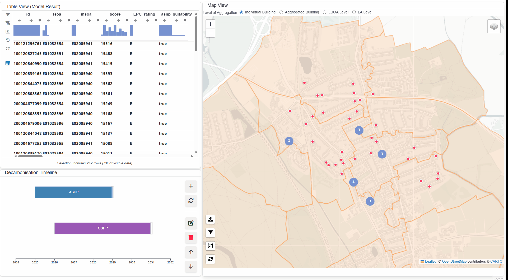
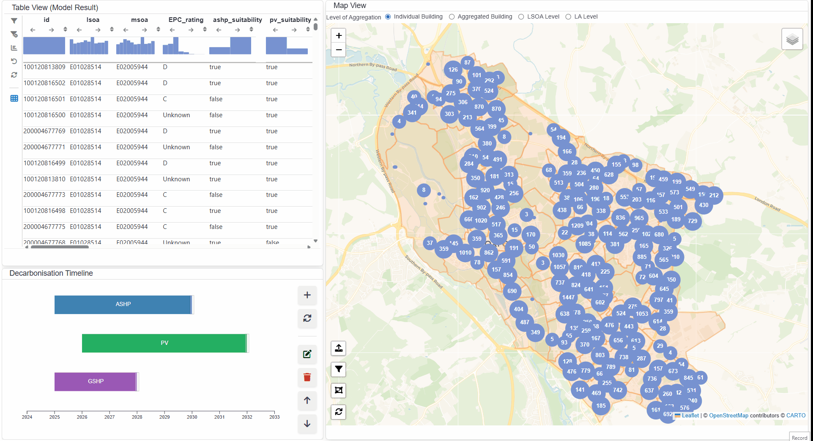
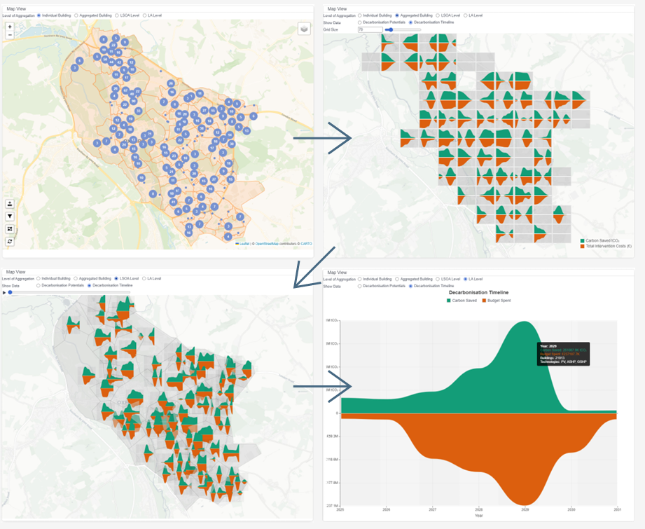

<!-- 
<h1> Interactive Visual Analytics<br>for Local Decarbonisation Planning </h1>

<h2> Empowering Policy‑Aligned Scenario Exploration </h2>

<hr>

<h3> D. Laksono, R. Jianu, &amp; A. Slingsby </h3>
<h4> City, University of London </h4>

<br>

<h3> Live Demo: <a href="https://decarb-vis.netlify.app">decarb-vis.netlify.app</a> &nbsp;&nbsp; Source: <a href="https://github.com/danylaksono/decarbonisation-glyphmap-planner">GitHub</a></h3> -->
<!-- 
{.absolute top=290 left=1000 width="200"}
{.absolute top=425 left=1000 width="200"}
{.absolute top=500 left=1010 height="65"} -->


```{=html}
  <div style="min-height:100%; display:flex; justify-content:center; align-items:center; position: relative;">
    <div style="width:100%; text-align:center;">
      
      <h1>Interactive Visual Analytics for Local Decarbonisation Planning</h1>
      <p style="font-size: 1.2em;">Empowering Policy-Aligned Scenario Exploration</p>
      <hr>
      <p><strong>Dany Laksono, Radu Jianu & Aidan Slingsby</strong></p>
      <p><small>City St. George's, University of London</small></p>
      </div>
   </div>
```

---


::: {.center}
With the 2050 deadline looming, the UK’s pursuit of its [net zero target]{.highlight-gold} is a contentious journey 
marked by legal and technical challenges, **the delegation of complex decarbonisation decisions to frontline local authorities**, and ongoing debate over the pace and feasibility of the transition.
:::

---

## The Challenge: 

Developing effective and equitable decarbonisation plans is a complex balancing act for UK local authorities.

:::: {.columns}
::: {.column width="50%"}
#### They must balance:

- Technical factors (Carbon reduction)
- Economic factors (Costs, budgets)
- Social factors (Fuel poverty, equity)
:::
::: {.column width="50%"}
#### ...exacerbated by:

- Conflicting stakeholder priorities.
- Massive, multivariate datasets.
- No single 'optimal' solution.
:::
::::

<div style="text-align: right;">
  <span class="fragment">This is a <span class="highlight-gold">wicked problem</span> in decision making.</span>
</div>

---

**Current approaches**: An optimisation-based model for decarbonisation planning to support Local Authority decision-making:

:::{.columns}
::: {.column width="50%"}
{height=250}

:::
::: {.column width="50%"}
{height=250}
:::
:::

<div style="text-align: right;">
  <span class="fragment">We identified some <span class="highlight-gold">limitations</span> with this approach.</span>
</div>

---

**First**, the monolithic optimisation models hide the trade-offs inherent in the planning process.

- it is [slow]{.highlight-gold}. The model can take hours (or even a day) to run.
- it is [not transparent]{.highlight-gold} to the user. The user cannot see the trade-offs inherent in the planning process.
- it often fails to model the [complex interactions]{.highlight-gold} between different factors in real-world scenarios.

**Second**, the choropleth map layer metaphor increases cognitive load by forcing users to mentally integrate fragmented information.

- it is [complicated to interpret]{.highlight-gold} the results of the model.
- it is not capturing the nuances of [multi-scale]{.highlight-gold} decarbonisation data.
- [temporal dynamics]{.highlight-gold} are not well represented in the choropleth map. 
- moreover, comparison between multiple [administrative areas]{.highlight-gold} is difficult.

---

## Our Approach: A Human-in-the-Loop Paradigm

We ask a different question: "_If we make this decision, what happens?_". 

1. Modular, Component-Based Planning  
   <small>Decomposes complex strategy-building into manageable, interpretable parts.</small>
2. Multi-Scale, Glyph-Based Visualisation  
   <small>Represents multivariate and temporal data uniformly across geographic scales.</small>
3. An Integrated, Iterative Workflow  
   <small>Tightly couples data exploration, simulation, and outcome analysis for real-time feedback.</small>

:::{.fragment}   
By enabling [an exploratory process with visual analytics]{.underline}, it [augments expert judgment]{.highlight-green} and makes trade-offs explicit.
:::
---

## The Decarbonisation Planner



:::{.aside}
[https://decarb-vis.netlify.app/](https://decarb-vis.netlify.app/)
:::
---

## A Workflow for Policy Exploration

Our system supports an iterative, four-step process (T1-T4):

::::{.columns}
:::{.columns width="60%"}

::: {.nonincremental}
1. Identify & Characterise Cohorts (T1)  
   <small>Use linked map and table to filter and select groups of buildings.</small>
2. Author Scenarios via Composition (T2)  
   <small>Define and layer modular plan components on the timeline.</small>
3. Compare Spatio-Temporal Outcomes (T3)  
   <small>Instantly simulate impacts and visualise them on the glyph-map.</small>
4. Explore Alternatives through Iteration (T4)  
   <small>Adjust parameters, re-order components, and immediately see the results.</small>
:::
:::

:::{.columns width=40%}
```{mermaid}
graph TD

%% Node style definitions
classDef cohorts fill:#e0f7fa,stroke:#00838f,stroke-width:2px,color:#004d40,font-weight:bold,font-size:14px,rx:8px,ry:8px;
classDef scenarios fill:#f3e5f5,stroke:#6a1b9a,stroke-width:2px,color:#311b92,font-weight:bold,font-size:14px,rx:8px,ry:8px;
classDef simulate fill:#fff9c4,stroke:#f57f17,stroke-width:2px,color:#e65100,font-weight:bold,font-size:14px,rx:8px,ry:8px;
classDef iterate fill:#e8f5e9,stroke:#2e7d32,stroke-width:2px,color:#1b5e20,font-weight:bold,font-size:14px,rx:8px,ry:8px;

%% Nodes
A([T1: Identify Cohorts]) --> B([T2: Author Scenarios])
B --> C([T3: Simulate and Evaluate])
C --> D([T4: Iterate and Refine])
D -.-> A

%% Apply classes
class A cohorts;
class B scenarios;
class C simulate;
class D iterate;

```
:::
::::
---

### T1: Identify Cohorts


---

### T2: Author Scenarios



---

### T3: Simulate and Evaluate


---

### T4: Iterate and Refine



---

## Visualising Complex Trade-offs with Glyphs

The glyph design replaces layered cartograms to visualise multivariate data. 

:::: {.columns}
::: {.column width="50%"}
{height="400"} 

:::
::: {.column width="50%"}
{height="400"}

:::
::::

---

## Conclusion & Future Work

We reframed decarbonisation planning from a [rigid, monolithic process]{.highlight-gold} into a [transparent, iterative dialogue]{.highlight-green} informed by contextual interviews with the industrial partner and client.

Future work will focus on:

1. [LLM-based user interface]{.highlight-green} – developing a natural language interface that enables decision-makers to interact with complex models more intuitively.
2. [Further user studies]{.highlight-green} – conducting structured evaluations with local authority planners to assess usability, trust, and decision support value.
3. [Side-by-side scenario comparison]{.highlight-green} – enabling direct visual and quantitative comparison of alternative decarbonisation pathways to support informed trade-offs.
4. [Scalability and generalisation]{.highlight-green} – extending the framework to other local authorities and contexts beyond the initial case study.

---


{height="150" fig-align="left"}

<hr>

### Thank You

#### D. Laksono, R. Jianu, & A. Slingsby

<div>
  <i class="fa-solid fa-envelope"></i> <a href="mailto:dany.laksono@city.ac.uk">dany.laksono@city.ac.uk</a>
</div>
<div>
  <i class="fa-brands fa-linkedin"></i> <a href="https://www.linkedin.com/in/danylaksono/">danylaksono</a>
</div>

giCentre, City St. George's, University of London.


<!-- 
<hr>

<small>[Live Demo]{.highlight-blue}: <https://decarb-vis.netlify.app></small>

<small>[Source Code]{.highlight-blue}: <https://github.com/danylaksono/decarbonisation-glyphmap-planner></small> -->


---

## Anticipated Q&A {visibility="hidden"}

### Q&A: Glyph Design Rationale

**Q:** Why not use simpler charts like bars?  
**A:** We optimise for at-a-glance assessment of temporal trade-offs across space.

1. Direct comparison via mirrored cost vs carbon saved
2. Focus on trajectory and cumulative nature
3. Space efficiency at scale

---

## Q&A: The Use of Cartograms {visibility="hidden"}

**Q:** Does distorting geography risk misleading the user?  
**A:** We intentionally sacrifice geographic fidelity to gain analytical clarity and perceptual fairness.

- Large, sparse areas can dominate visually
- Grid cartogram gives equal visual prominence
- Users can toggle back to standard view for context

---

## Q&A: Role of Multi-Objective Decision Making {visibility="hidden"}

:::: {.columns}
::: {.column width="50%"}
#### MOO & Pareto Fronts

- Computes a set of mathematically optimal solutions
- User explores pre-computed results
- Struggles with qualitative objectives (e.g., equity)
:::
::: {.column width="50%"}
#### Our System's Approach

- Facilitates human-led exploration of decision space
- User authors scenarios based on objectives
- Augments the decision-maker, does not automate the decision
:::
::::

